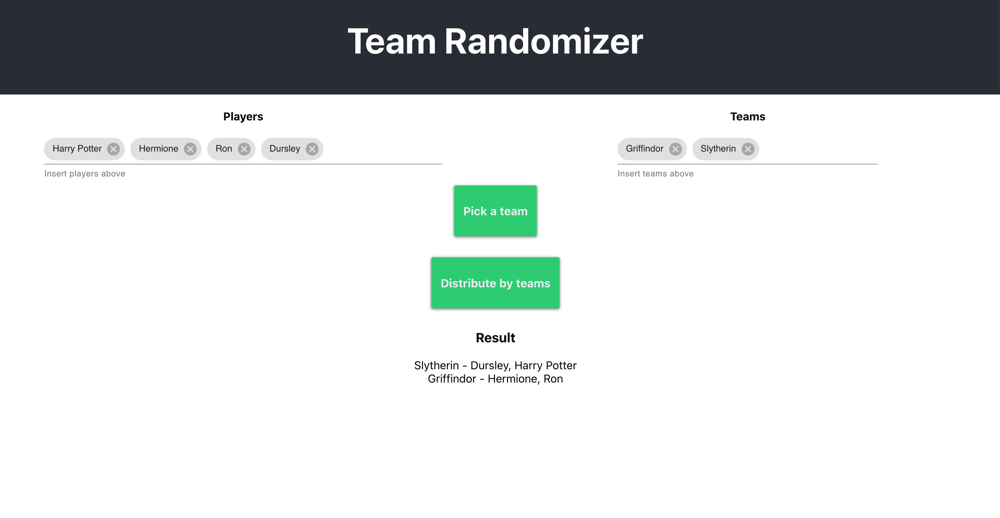

# Team Randomizer

Web application to randomize teams. Currently the only existing mode is to select a random team and attribute to a player.

## Test locally

1. Install yarn
2. Run _yarn_ on console
3. Run yarn start on console
